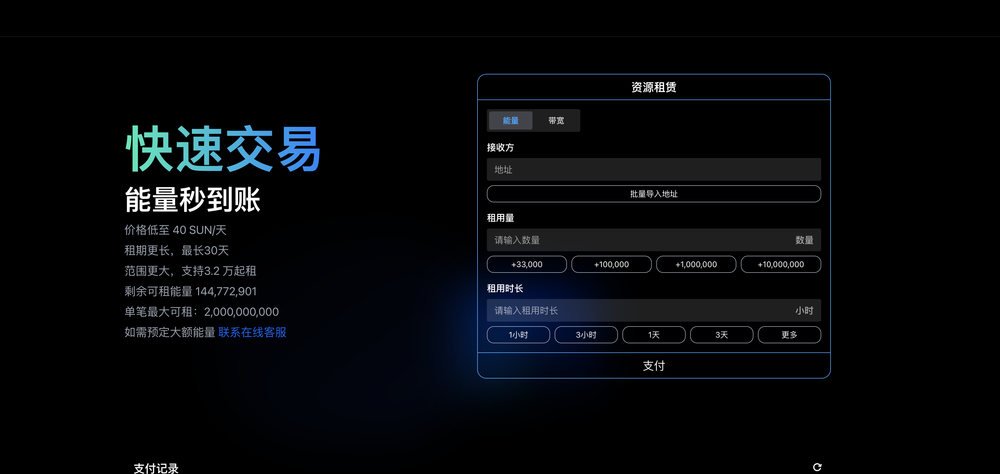

# LightningEnergy

**LightningEnergy** 是一个基于TRON区块链的能量租赁与自动回收平台。此平台采用Java、Spring Boot WebFlux，以及MongoDB和Redis数据库，提供高性能和响应式的Web应用程序环境，旨在为用户提供一种有效、透明的能量管理解决方案。

## 相关项目

- **网站前端**：[Lightning Energy - Frontend](https://github.com/avengers-777/lightning_energy) 使用Next.js, TypeScript和React技术栈构建。
- **管理后台**：[Lightning Control Center - Admin Panel](https://github.com/avengers-777/lightning_control_center) 也基于Next.js, TypeScript和React技术栈。

## 技术栈

- **Java SDK 21**
- **Spring Boot WebFlux**
- **MongoDB**
- **Redis**
- **Next.js**
- **TypeScript**
- **React**

## 开始使用

### 环境准备

确保你的开发环境中已安装以下软件：
- Java JDK 21
- MongoDB
- Redis
- Git

### 安装和配置MongoDB

1. **安装MongoDB**：访问 [MongoDB官方下载页面](https://www.mongodb.com/try/download/community) 下载并安装适合你操作系统的MongoDB版本。

2. **启动MongoDB服务**：
    - 对于Mac和Linux系统，通常可以通过以下命令启动：
      ```bash
      mongod
      ```
    - 对于Windows，你可能需要指向安装目录下的 `mongod.exe` 文件。

3. **配置副本集**：
    - 启动MongoDB实例时，需要启用副本集功能。可以通过修改MongoDB的配置文件或在启动时指定参数来实现。
    - 在MongoDB配置文件中（通常名为 `mongod.conf`），添加副本集设置：
      ```yaml
      replication:
        replSetName: "rs0"
      ```
    - 重启MongoDB服务，并通过MongoDB shell初始化副本集：
      ```bash
      mongo
      > rs.initiate()
      ```

### 安装Redis

1. **安装Redis**：
    - 对于Mac用户，可以使用Homebrew：
      ```bash
      brew install redis
      ```
    - 对于Linux用户，可以使用包管理器，例如：
      ```bash
      sudo apt-get install redis-server
      ```
    - Windows用户可以下载并安装从 [Redis官方下载页面](https://redis.io/download)。

2. **启动Redis服务**：
    - 通常在安装后Redis会自动启动。
    - 可以通过运行 `redis-cli ping` 检查Redis服务器是否运行，期待的回应是 `PONG`。

### 配置项目

1. 克隆项目仓库：
   ```bash
   git clone https://github.com/yourusername/LightningEnergy.git
   ```
2. 进入项目目录：
   ```bash
   cd LightningEnergy
   ```
3. 构建项目：
   ```bash
   ./mvnw clean install
   ```
4. 运行项目：
   ```bash
   ./mvnw spring-boot:run
   ```


## 配置指南

为了确保 **LightningEnergy** 平台可以成功连接和交互TRON区块链，你需要配置 `application.yml` 文件中的几个关键属性。以下是配置步骤：

### 修改 `application.yml`

找到项目中的 `application.yml` 文件，通常位于 `src/main/resources/` 目录下，然后填写以下属性：

```yaml
tron:
  api-key: "你的API键"
  default-private-key: "你的私钥"
  default-address: "你的TRON地址"
```

### 获取 API Key

1. 访问 [TRON Grid](https://www.trongrid.io/) 官方网站。
2. 注册或登录你的账户。
3. 在管理控制台中创建一个新的API Key。
4. 将生成的API Key复制并粘贴到 `application.yml` 文件的 `api-key` 字段。

### 设置私钥和地址

1. 使用你的TRON钱包或通过TRON网络的其他可靠工具生成一个新的私钥和地址(空账户即可)。
2. 将私钥复制到 `default-private-key` 字段。
3. 将相应的TRON地址复制到 `default-address` 字段。

### 注意

- **保密**：API键和私钥包含敏感信息，不应公开或分享给未经授权的个人。
- **安全存储**：确保这些信息在安全的环境中存储和使用，避免潜在的安全风险。

确保完成上述配置后，项目应能够成功连接到TRON区块链，并执行所需的操作。


## 如何使用


### 注册管理员账号

管理员账号的注册需通过API接口进行。由于安全和管理原因，**只有第一个管理员可以使用此接口进行注册**。以下是注册过程的详细说明：

1. **编写注册请求**：
   - 使用Postman或其他API测试工具，准备一个POST请求，目标地址为 `/a/v1/pub/admin/register`。
   - 在请求体中包含以下信息：
     ```json
     {
       "name": "管理员名字",
       "ethereumAddress": "你的以太坊地址",
       "permissions": [],
       "status": "ACTIVE"
     }
     ```
   - 确保以太坊地址是使用MetaMask提供的地址，且地址通过 `checksumAddress` 方法转化为校验和地址。

2. **发送注册请求**：
   - 确保Postman中设置了正确的Content-Type（通常为 `application/json`）。
   - 发送POST请求，系统将处理注册。

3. **验证注册结果**：
   - 系统会返回相应的结果，包括管理员的详细信息和注册状态。

通过这种方式，你可以确保管理员账号的注册既安全又符合系统的管理规定。使用MetaMask的签名验证与API接口的结合使用，可以有效地保障后台的安全性和完整性。


### 登录管理后台

**LightningEnergy** 的管理后台使用MetaMask钱包进行身份验证。在管理界面中使用MetaMask进行登录，但在管理员账号的创建和注册需要通过另一种方式进行，具体步骤如下：

1. **安装MetaMask**：
   - 如果你还没有安装MetaMask扩展，可以访问 [MetaMask官网](https://metamask.io/) 下载并安装到你的浏览器。

2. **准备一个MetaMask地址**：
   - 确保你的MetaMask钱包中有至少一个地址。此地址无需持有任何资产，仅用于身份验证。

3. **登录**：
   - 打开管理后台的登录页面。
   - 点击登录按钮后，MetaMask将弹出请求签名的消息。
   - 确认签名操作，系统将使用MetaMask的签名机制来验证你的身份。


### 账号资源与授权

登录后台后，管理员需要完成以下步骤来配置和启动能量代理与回收功能：

1. **创建一个TRON账号**：
   - 在控制台中选择创建TRON账号的选项。
   - 按照指示完成账号的创建。创建完成后，你将获得一个新的TRON地址。

2. **授权Active Permission**：
   - 使用你的主TRON钱包（资源账号）授权给新创建的TRON账号授权Active Permission（代理资源，回收资源）。这允许系统自动代理资源和回收资源。


通过完成上述步骤，管理后台就配置完成了，能够开始自动代理与回收功能，前台页面能够正常工作。

### 注意事项

- 保证在操作中使用正确的TRON地址和密钥，避免资金损失。
- 使用MetaMask进行的所有操作都应仔细验证，以确保安全性。


## 如何贡献

我们欢迎所有形式的贡献，无论是功能性改进、bug修复还是文档更新。请遵循以下步骤进行贡献：

1. Fork 仓库。
2. 创建新的分支 (`git checkout -b feature/AmazingFeature`)。
3. 提交你的更改 (`git commit -m 'Add some AmazingFeature'`)。
4. 推送到分支 (`git push origin feature/AmazingFeature`)。
5. 打开一个Pull Request。

## 许可证

本项目采用 [MIT 许可证](LICENSE.md)。请查看 `LICENSE.md` 文件了解详细信息。

## 联系方式

- **项目链接**: [https://github.com/avengers-777/LightningEnergy](https://github.com/avengers-777/LightningEnergy)
- **Telegram**: [@bitcyber](https://t.me/bitcyber)


